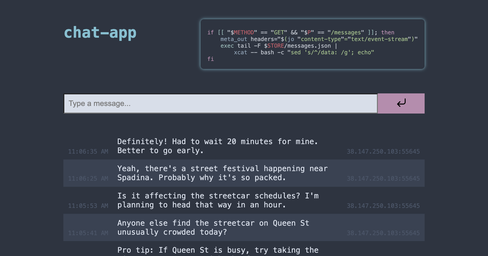

`chat-app` is an experiment in how it would look to build a service exclusively with [small tools](https://gist.github.com/cablehead/efbe67fb90b8dde21a7c885f91f3f75d)

## Live example

https://ndyg.cross.stream/projects/chat-app

## Requirements

I know! GL 😆

- `bash`
- `sed`
- `tail`
- [`jo`](https://github.com/jpmens/jo)
- [`jq`](https://jqlang.github.io/jq/)
- `tera`
- [`xcat`](https://github.com/cablehead/xcat)
- [`http-sh`](https://github.com/cablehead/http-sh)

Seriously though, if you're curious, and have trouble installing any of these, open an issue, and I'll try and help.

## To Run

```bash
git clone https://github.com/cablehead/chat-app.git
cd chat-ap
http-sh :5002 -- ./root.sh ./store
open http://localhost:5002
```

You should see:


